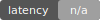

# 天将 TianJiang — LLM 推理成本优化与 Token 治理引擎（Token Governor）
**天将 TianJiang 提供生产级 LLM 推理成本控制、Token 节省、自动策略治理与可复现实验报告。**  
*TianJiang is an LLM inference cost optimization and token governance engine (Token Governor) for AI Agents.*

**关键词 / Keywords**：
LLM 成本优化、Token 节省、推理成本、智能体（Agent）、上下文压缩、语义缓存、工具 Top-K、预算守卫、自动策略（Auto）、模型画像（Model Profile）、推理路由（Model Routing）  
LLM cost optimization, token savings, inference cost, AI agents, context compression, semantic cache, tool top-k, budget guard, auto strategy, model profiling, model routing

<div align="center">
  
  
</div>

<div align="center">
  
  
  
  
</div>

---

## 🧠 一、简介 / Introduction
**中文说明：**  
天将 TianJiang（Token Governor）是一套面向生产级 LLM 推理阶段的成本与策略治理框架，支持 Token 节省、动态策略推荐、模型路由、缓存与压缩等多种优化策略组合。

**English Description:**  
TianJiang (Token Governor) helps reduce inference cost and improve runtime stability by combining strategy profiles, drive modes, caching/compression controls, and automated benchmark reporting.

---

## 🚀 二、快速开始 / Quick Start

### 📦 Clone & Install / 克隆与安装
```bash
git clone https://github.com/joy7758/token-governor.git
cd token-governor

python3 -m venv venv
source venv/bin/activate
pip install -r requirements.txt
```

配置环境变量（任选其一）：
```bash
export OPENAI_API_KEY="your_openai_key"
# 或
export GOOGLE_API_KEY="your_google_key"
```

### 📊 Run Baseline / 基础测试
```bash
python main.py --mode baseline --limit 20 --out-file metrics/data/baseline.jsonl
```

### 🛡️ Run Governor / 策略控制
```bash
python main.py --mode governor --drive-mode eco \
  --policy-file policy.yaml \
  --tasks-file metrics/benchmarks/benchmark_v02_60_tasks.json \
  --limit 20 \
  --out-file metrics/data/governor.jsonl
```

### 📈 Generate Report / 生成对比分析
```bash
python -m metrics.report \
  --baseline metrics/data/baseline.jsonl \
  --governor metrics/data/governor.jsonl \
  --outdir metrics/reports/compare-real \
  --interactive
```

### 🤖 CI Auto Update / GitHub Actions 自动更新
1. 在仓库 `Settings -> Secrets and variables -> Actions` 配置至少一个密钥：
`OPENAI_API_KEY` 或 `GOOGLE_API_KEY`
2. 打开 `Actions`，运行工作流 `Benchmark And Update README Metrics`
3. 默认会执行完整 benchmark，然后自动更新 README 图表与指标并提交

---

## ✨ 三、核心功能 / Features

| Feature | 说明 | Description |
| --- | --- | --- |
| 多驱动模式 | Eco / Auto / Comfort / Sport / Rocket | Drive modes for different cost-vs-quality trade-offs |
| 自动策略推荐 | 自动分析任务并推荐最优策略 | Adaptive strategy recommendation |
| 多策略组合 | 缓存、压缩、路由、RAG 等 | Semantic cache, prompt compression, model routing, RAG |
| 自动报告生成 | JSON / Markdown / 可视化图表 | Automated comparative reporting |
| CLI 参数控制 | 丰富的命令行配置选项 | Command-line interface with rich options |
| 模型画像支持 | 支持 `--model-profile` 驱动推荐偏置 | Profile-guided auto strategy hints |

---

## 🧪 四、使用示例 / Usage Examples

### 🚗 Eco 模式（最省 Token）
```bash
python main.py --mode governor --drive-mode eco --limit 20
```

### 🤖 Auto 模式（智能推荐）
```bash
python main.py --mode governor --drive-mode auto --auto-strategy --limit 20
```

### 🚀 Rocket 模式（高质量输出）
```bash
python main.py --mode governor --drive-mode rocket --enable-agentic-plan-cache --limit 20
```

---

## 📊 五、对比图与实时指标 / Metrics & Visuals

<!-- CHART_IMAGE_START -->

<!-- CHART_IMAGE_END -->

<!-- REAL_METRICS_START -->
### 📊 实测结果 / Real Benchmark Results

- **Token 变化 / Token Change**：**+77.65%**（Token Increase）
- **成功率 / Success Rate**：Baseline **100.00%** → TianJiang (rocket) **100.00%**
- **延迟 / Latency**：Baseline **6.63s** → TianJiang (rocket) **10.26s** (+54.62%)
- **总 Token / Total Tokens**：Baseline **935** → TianJiang (rocket) **1,661** (+77.65%)
- **统计口径 / Method**：Total Tokens = count × mean_token（input+output）

> 数据源 / Data source: `metrics/reports/compare-real-check/comparison.json` | Generated (UTC): `2026-03-03T13:55:47.575675+00:00` | ΔSuccess: +0.00pp

**关键词 / Keywords**：天将, TianJiang, Token Governor, LLM 成本优化, Token 节省, 推理成本, 智能体, 上下文压缩, 语义缓存, 工具 Top-K, 预算守卫, 自动策略, 模型画像, 推理路由, LLM cost optimization, token savings, inference cost, AI agents, context compression, semantic cache, tool top-k, budget guard, auto strategy, model profiling, model routing
<!-- REAL_METRICS_END -->

---

## 📍 六、参数说明 / CLI Reference

| 参数 / Parameter | 说明 / Description | 默认值 / Default |
| --- | --- | --- |
| `--mode` | 运行模式：`baseline` / `governor` | `baseline` |
| `--drive-mode` | 驾驶模式：`auto/eco/comfort/sport/rocket` | `None` |
| `--opt-strategy` | 手动策略：`light/balanced/knowledge/enterprise` | `balanced` |
| `--auto-strategy` | 启用自动策略推荐 | `False` |
| `--limit` | 任务数量限制 | `None`（全部默认任务） |
| `--model` | 模型选择（如 `auto`, `openai:gpt-4o-mini`） | `auto` |
| `--max-tokens` | Governor 每任务累计 token 预算 | `12000` |
| `--max-fallback` | Governor 最大 fallback 次数 | `2` |
| `--out-file` | 结果 JSONL 输出路径 | `None` |
| `--model-profile` | 模型画像 JSON 路径 | `None` |
| `--policy-file` | Policy YAML 路径（v0.2 gate/fallback/risk 配置） | `policy.yaml` |
| `--tasks-file` | 任务集文件（`.json` / `.jsonl`） | `None`（使用内置任务） |

---

## 🧪 七、Benchmark v0.2

- 任务集（60 条）：`metrics/benchmarks/benchmark_v02_60_tasks.json`
- JSONL 版本：`metrics/benchmarks/benchmark_v02_60_tasks.jsonl`
- 类别分布：5 类 × 12 条（单轮无工具 / 单工具敏感 / 多工具串联 / 长历史 / 对抗安全）

运行示例：

```bash
python main.py --mode governor \
  --policy-file policy.yaml \
  --tasks-file metrics/benchmarks/benchmark_v02_60_tasks.json \
  --out-file metrics/data/governor-v02.jsonl
```

自动判定示例：

```bash
python -m metrics.validator \
  --tasks metrics/benchmarks/benchmark_v02_60_tasks.json \
  --records metrics/data/governor-v02.jsonl \
  --out metrics/reports/validator-v02.json
```

---

## 📊 八、Dashboard

生成可视化 Dashboard（帕累托、分类柱状、失败分布、压缩率关系）：

```bash
python -m metrics.dashboard.benchmark_dashboard \
  --governor metrics/data/governor-v02.jsonl \
  --baseline metrics/data/baseline-v02.jsonl \
  --outdir metrics/reports/v02-dashboard
```

输出目录默认包含：
- `pareto_scatter.html/png`
- `category_bars.html/png`
- `failure_pie.html/png`
- `compression_success.html/png`
- `summary_panel.png`
- `category_summary.csv`
- `overall_summary.csv`
- `dashboard_summary.json`

---

## 🔁 九、CI 自动化

新增工作流：`.github/workflows/benchmark-v02-dashboard-auto.yml`

- 触发：`push main` + `workflow_dispatch`
- 自动执行：baseline benchmark → governor benchmark → validator → dashboard → comparison report → README metrics 更新 → 自动提交

新增轻量定时工作流：`.github/workflows/benchmark-v02-daily-light.yml`

- 触发：daily `cron` + `workflow_dispatch`
- 默认只跑 `limit=20` 轻量任务
- 自动执行 guardrail 检查（成功率跌幅 / token 增幅 / 延迟增幅阈值）
- guardrail 失败时自动创建（同日去重）issue，并可 @维护者，最终标记 job failed
- 自动生成 `docs/trends/*.json`、`docs/badges/*.svg`、`docs/trends/kpi_summary.md`
- 可选通知脚本：`scripts/notify_slack.py`、`scripts/notify_dingtalk.py`、`scripts/notify_email.py`
- 趋势页面发布工作流：`.github/workflows/publish-trends-pages.yml`

本地一键执行同等流程：

```bash
bash scripts/run-benchmark-v02-dashboard.sh
```

---

## 🧠 十、典型场景 / Use Cases

**中文：**
- 企业级 LLM 推理成本优化
- 多模型推理策略治理
- Agent 智能体推理优化
- 自动化对比实验与报告

**English:**
- Enterprise LLM inference cost control
- Multi-model strategy governance
- Agent runtime optimization
- Automated benchmarking and reporting

---

## ❓ 十一、常见问题 / FAQ

**Q1: 什么是 Drive Mode？**  
A: Drive Mode 用于在成本与质量之间做权衡，例如 Eco 模式优先节省 Token，而 Rocket 模式优先输出质量。

**Q2: Auto 和 Comfort 有何区别？**  
A: Auto 是任务特征驱动的动态推荐路径；Comfort 是固定平衡型档位。

**Q3: 自动模式会覆盖手动参数吗？**  
A: 不会。显式传入的 CLI 参数优先级更高。

**Q4: Auto 模式一定会进入 Rocket 吗？**  
A: 不会。Auto 会根据任务特征与预算约束动态选档，可能停在 Eco/Comfort/Sport。

**Q5: Rocket 模式一定更省钱吗？**  
A: 不一定。Rocket 优先保证输出能力，不承诺 Token 成本最低；请以实测对比区块为准。

**Q6: 如何一键复现实验并更新 README？**  
A: 多模式对比可执行 `bash scripts/run-all-and-update.sh`；v0.2 benchmark + dashboard 可执行 `bash scripts/run-benchmark-v02-dashboard.sh`；远端可运行 `Benchmark v0.2 Dashboard Auto` 或 `Benchmark And Update README Metrics`。

---

## 👥 十二、贡献指南 / Contributing

欢迎提交 Issue 和 Pull Request，细则见 [CONTRIBUTING.md](CONTRIBUTING.md)。

---

## 📜 十三、许可证 / License

本项目使用 **TianJiang Non-Commercial License v1.0**：
- 非商用可免费使用
- 商用需要先购买授权或建立合作协议  
详见 [LICENSE](LICENSE)。

---

## 📚 十四、参考 / References

- [Best-README-Template](https://github.com/othneildrew/Best-README-Template)
- [Awesome README Collection](https://github.com/matiassingers/awesome-readme)
- [standard-readme](https://github.com/RichardLitt/standard-readme)
