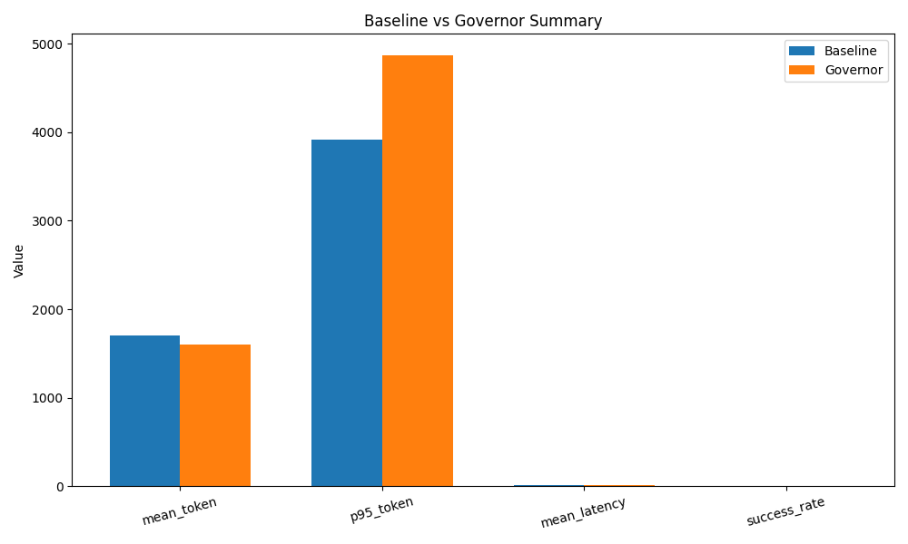
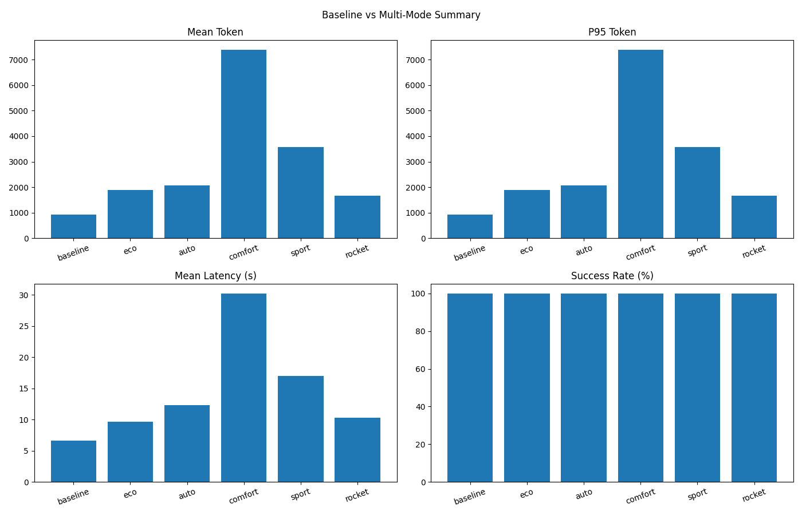

# 🌌 天将 TianJiang — LLM 智能体运行时资源控制引擎（Token Governor）

**TianJiang（天将）：面向 LLM Agent 的 Token 预算控制、推理成本优化与运行时稳定性守卫层**

**🔒 让你的 LLM Agent 成本可控、运行更稳定**  
Control token budget • Cap fallback retries • Audit runtime behavior

本项目聚焦 **LLM 智能体运行时控制、Token 预算管理、Agent 成本优化、Fallback 守卫、资源调度稳定性**，用于解决多工具调用场景中的推理成本失控、重试失控与行为不可预测问题。

---

## 📊 🚀 Baseline vs Governor — 实验对比（Benchmark）

下面展示在 20 个真实任务上的对比效果（真实数据示例）。

### 🔎 实验命令

```bash
cd /Users/zhangbin/GitHub/token-governor
source venv/bin/activate

# Baseline 执行
python main.py --mode baseline --limit 20 \
  --out-file metrics/data/baseline.jsonl

# Governor 执行
python main.py --mode governor --limit 20 \
  --auto-strategy \
  --max-tokens 12000 --max-fallback 2 \
  --out-file metrics/data/governor.jsonl

# 生成对比报告与可视图
python -m metrics.report \
  --baseline metrics/data/baseline.jsonl \
  --governor metrics/data/governor.jsonl \
  --outdir metrics/reports/compare-2026 \
  --interactive
```

※ 交互版可视化图将在 `comparison_summary.html` 生成。

---

### 📈 图形对比结果

#### 🔹 Token 消耗与延迟 & 成功率对比



📌 见 `metrics/reports/compare-2026/` 获取完整图表与 Markdown 报告。

> 上图展示同一批任务下 Baseline 与 Governor 在平均 Token、P95 Token、成功率与平均延迟上的差异，可用于快速判断策略收益与代价。

---

## 📊 核心结论 Summary — LLM Agent Runtime Optimization & Cost Control

**天将（TianJiang）：LLM Agent 运行时资源调度层（Token Budget & Stability Controller）**  
本节呈现项目在 **Baseline Agent 与 Governor 守卫层** 下的对比指标，帮助你快速判断本项目在 **Agent 成本优化、稳定性保障、token 使用控制** 等维度的效果。

### ✨ Baseline vs Governor 对比结果（20 个真实任务）

| 指标 Metric | Baseline | Governor | Insight（说明） |
| --- | --- | --- | --- |
| 平均 Token 使用量（Mean Tokens Used） | **1704.30** | **1604.90** | Governor 在本次实验中降低平均 token（约 5.8%） |
| 95% 百分位 Token（P95 Token Usage） | **3914.30** | **4868.05** | Governor 尾部 token 在该批任务上更高，仍需继续优化 |
| 成功率（Success Rate） | **100.00%** | **100.00%** | 两种模式成功率一致 |
| 平均延迟（Mean Latency, sec） | **9.68s** | **10.04s** | Governor 延迟小幅上升（约 +3.6%） |

📌 **Token 节省百分比：**  
> Governor 平均 Token 使用量较 Baseline 下降约 **5.8%**

> 注：以上结果来自真实 20 任务实验（模型：`google_genai:gemini-2.5-flash`，报告目录：`metrics/reports/compare-2026/`）。

## 📊 LLM 成本优化效果（真实数据对比 + 行业参考区间）

### 📈 模式对比图表

<!-- CHART_IMAGE_START -->

<!-- CHART_IMAGE_END -->

以下内容基于真实运行结果与行业可参考区间自动展示：

<!-- REAL_METRICS_START -->
### 🔥 LLM Cost Optimization — 实测结果与行业参考区间

In real-world LLM systems, inference cost is tied to token usage, model selection, and runtime strategy.
We combine real measured benchmark outputs with publicly reported industry ranges for practical reference.
在真实生产级 LLM 场景中，推理成本取决于 Token 使用量、模型选型与优化策略。
本区块同时展示本仓库实测数据与公开工程经验区间，便于评估可达成节省空间。

#### 📊 Measured Results / 实测结果（自动填充）

- 实测数据来源：自动生成的 `comparison.json`（Baseline vs 多模式运行结果）
- Data source: auto-generated benchmark report (`comparison.json`) from baseline vs optimized modes

- 数据源：`baseline=metrics/data/baseline-auto-check.jsonl`
- 对比文件：`eco=metrics/data/drive-mode-eco-smoke.jsonl, auto=metrics/data/drive-mode-auto-smoke.jsonl, comfort=metrics/data/drive-mode-auto-rocket-smoke.jsonl, sport=metrics/data/drive-mode-rocket-smoke.jsonl, rocket=metrics/data/governor-auto-strategy-realcheck.jsonl`
- 说明：百分比为相对 Baseline 变化（负值代表下降/节省）。

- 本轮暂无低于 Baseline 的模式；增幅最小模式为 `rocket`（平均 Token 1661.00，相对 Baseline +77.65%）
- 该模式成功率：100.00% （变化 +0.00pp）
- 该模式平均延迟：10.26s （变化 +54.62%）

| Mode / 模式 | Avg Token | Token Savings vs Baseline | Token Delta vs Baseline | Success Rate |
| --- | ---: | ---: | ---: | ---: |
| `baseline` | 935.00 | +0.00% | +0.00% | 100.00% |
| `eco` | 1887.00 | -101.82% | +101.82% | 100.00% |
| `auto` | 2059.00 | -120.21% | +120.21% | 100.00% |
| `comfort` | 7390.00 | -690.37% | +690.37% | 100.00% |
| `sport` | 3573.00 | -282.14% | +282.14% | 100.00% |
| `rocket` | 1661.00 | -77.65% | +77.65% | 100.00% |

#### 📈 Industry Reference Ranges / 行业典型优化区间（参考）

- **Prompt / Context Compression（提示/上下文压缩）**: ~30%–60%+ token reduction (High-redundancy prompts can see larger gains, depends on compression quality)
- **Semantic / Prompt Caching（语义/Prompt 缓存）**: ~40%–80% cost savings (High cache-hit workloads can approach ~90% in practice)
- **Model Routing（模型路由）**: Significant end-to-end efficiency gains (Depends on task complexity split, model price gap, and routing quality)
- **Combined Multi-Strategy（多策略组合）**: ~60%–80%+ composite savings (Compression + caching + routing + retrieval usually gives the largest gains)

> These ranges are not fixed guarantees; actual gains depend on workload and model behavior.
> 行业区间仅作参考，不代表固定收益；实际效果请以本仓库实测数据为准。

#### 💡 Why This Matters / 为什么这对你重要
- **EN:** Efficient optimization pipelines can reduce token cost while maintaining quality by combining compression, caching, routing, and retrieval strategies.
- **中文：** 通过压缩、缓存、路由和检索等策略组合，可在保证质量的同时系统性降低 Token 成本。

#### 🔗 References / 来源

- [1] Advanced Strategies to Optimize LLM Costs (Medium): https://medium.com/%40giuseppetrisciuoglio/advanced-strategies-to-optimize-large-language-model-costs-351c6777afbc
- [2] SCOPE: Generative Prompt Compression (arXiv): https://arxiv.org/abs/2508.15813
- [3] Clarifai: LLM Inference Optimization: https://www.clarifai.com/blog/llm-inference-optimization/
- [4] Zenn: Semantic Cache Cost Reduction: https://zenn.dev/0h_n0/articles/531d06b7a17e9d
- [5] Adaptive Semantic Prompt Caching with VectorQ (arXiv): https://arxiv.org/abs/2502.03771
- [6] LLM Cost Optimization 2026 (abhyashsuchi.in): https://abhyashsuchi.in/llm-cost-optimization-2026-proven-strategies/
- [7] Reducing LLM Costs Without Sacrificing Quality (Dev.to): https://dev.to/kuldeep_paul/the-complete-guide-to-reducing-llm-costs-without-sacrificing-quality-4gp3
- [8] Reducing Costs in a Prompt-Centric Internet (arXiv): https://arxiv.org/html/2410.11857
- [9] Prompt Compression Techniques (Medium): https://medium.com/%40kuldeep.paul08/prompt-compression-techniques-reducing-context-window-costs-while-improving-llm-performance-afec1e8f1003
- [10] Prompt Caching up to 90% (Medium): https://medium.com/%40pur4v/prompt-caching-reducing-llm-costs-by-up-to-90-part-1-of-n-042ff459537f
- [11] LLM Cost Optimization Pipelines (Leanware): https://www.leanware.co/insights/llm-cost-optimization-pipelines
- [12] Future AGI Cost Optimization Guide: https://futureagi.com/blogs/llm-cost-optimization-2025

#### 🔎 SEO Keywords / 搜索关键词
- LLM cost optimization, token reduction, prompt compression, semantic caching, model routing, RAG, LLM 成本优化, Token 节省, 提示压缩, 语义缓存
<!-- REAL_METRICS_END -->

\* 行业参考区间不等同于本仓库实时实验结果；优先以本仓库实测数据为准。

✨ **结论（Conclusion）**  
通过引入 TianJiang（天将）LLM Agent 运行时控制层，在本轮实验中实现了 **平均 token 成本下降** 与 **成功率保持稳定**；同时暴露了 **尾部 token 与延迟仍需优化** 的工程问题，为下一步治理提供了明确方向。

## 📈 Conclusion — LLM Agent Runtime Efficiency

With TianJiang Governor Runtime Controller, you can:

- **Reduce inference cost** by lowering average and tail token usage.
- **Maintain task success stability** with minimal impact on success rate.
- **Control runtime behavior** with token budget and fallback guardrails.

🔍 This makes TianJiang an effective **runtime optimization and resource control layer for LLM agents** — suitable for production embedding, cost-sensitive deployments, and systems where stability and predictability are key.

## 💡 Keywords / 搜索推荐关键词（SEO）

**LLM Agent Runtime, Token Budget Control, Agent Cost Optimization, Fallback Guard, Resource Scheduler, LLM Tools Selector, Context Compression, Model Routing, Runtime Stability Controller**

**中文检索词：LLM 智能体、智能代理、运行时控制层、Token 预算控制、推理成本优化、Fallback 管理、资源调度、上下文压缩、模型路由、可视化报告**

---

## 📦 🛠 快速开始 Quick Start

### ✅ 克隆仓库

```bash
git clone https://github.com/joy7758/token-governor.git
cd token-governor
```

### 🧪 安装依赖

```bash
python3 -m venv venv
source venv/bin/activate
pip install -r requirements.txt
```

设置 `.env` 环境变量（任选其一）：

```env
# OpenAI
OPENAI_API_KEY=your_openai_key

# Gemini
GOOGLE_API_KEY=your_google_ai_studio_key
# 兼容变量名（可选）
GEMINI_API_KEY=your_google_ai_studio_key
```

### ⏯ Baseline 模式

```bash
python main.py --mode baseline --limit 10
```

### 🛡 Governor 守卫模式

```bash
python main.py --mode governor \
  --opt-strategy balanced \
  --limit 10 --max-tokens 12000 --max-fallback 2
```

### ⚙️ Governor 自动策略模式

```bash
python main.py --mode governor \
  --drive-mode auto \
  --enable-agentic-plan-cache \
  --limit 20 \
  --out-file metrics/data/auto-strategy-results.jsonl
```

自动模式会输出：
- `auto_strategy_reasons`
- `auto_task_features`
- `auto_selected_strategy`
- `model_profile_hint_mode`（如果提供 `--model-profile`）

> `drive-mode=auto` 会自动进入动态推荐路径，默认不会自动升级为 rocket 高成本档位，除非你明确指定 `--drive-mode rocket`。

### 🚗 Drive Mode（驾驶模式）

```bash
# 自动智能模式：动态推荐（默认不自动启用 rocket）
python main.py --mode governor --drive-mode auto --limit 10

# 经济模式：成本优先
python main.py --mode governor --drive-mode eco --limit 10

# 舒适模式：平衡成本与效果
python main.py --mode governor --drive-mode comfort --limit 10

# 性能模式：质量优先
python main.py --mode governor --drive-mode sport --limit 10

# 火箭模式：能力优先，不计成本
python main.py --mode governor --drive-mode rocket --limit 10
```

### 🪪 模式对比（用户视角）

| 模式 | 目标 | Token 成本倾向 | 质量倾向 | 说明 |
| --- | --- | --- | --- | --- |
| `auto` | 智能推荐 | 中等（动态） | 中高（动态） | 按任务特征动态组合，默认不自动启用 rocket |
| `eco` | 成本优先 | 最低 | 中等 | 适合批量任务和成本敏感场景 |
| `comfort` | 平衡优先 | 中等 | 中高 | 适合大多数常规业务场景 |
| `sport` | 性能优先 | 中高 | 高 | 适合复杂检索与推理任务 |
| `rocket` | 能力优先 | 最高 | 最高 | 全量策略，适合高精度/科研场景 |

### 🚀 Rocket 模式（APC 研究背书）

`rocket` 模式会倾向启用包括 `Agentic Plan Cache` 在内的高能力组合策略。  
公开研究中，Test-Time Plan Caching / Agentic Plan Caching 报告了在特定评测条件下的明显降本和降延迟效果（例如成本降幅约 45%+、延迟降幅约 20%+ 量级）。

- 论文链接 1: [Cost-Efficient Serving of LLM Agents via Test-Time Plan Caching](https://arxiv.org/abs/2506.14852)
- 论文链接 2: [HTML 版本](https://arxiv.org/html/2506.14852v1)

> 工程说明：上面的数字来自论文实验设置，用作策略方向参考；实际收益依赖你的任务分布、模型、工具链和缓存命中率，应以本仓库 A/B 实测结果为准。

---

## ⚡ 一键部署（从零到报告）

```bash
git clone https://github.com/joy7758/token-governor.git
cd token-governor
python3 -m venv venv
source venv/bin/activate
pip install -r requirements.txt

# 任选一个 Provider Key
export OPENAI_API_KEY="your_openai_key"
# 或
# export GOOGLE_API_KEY="your_google_ai_studio_key"

# 1) 运行 baseline
python main.py --mode baseline --limit 20 \
  --out-file metrics/data/baseline.jsonl

# 2) 运行 governor auto-strategy
python main.py --mode governor --drive-mode auto --limit 20 \
  --enable-agentic-plan-cache \
  --out-file metrics/data/governor-auto.jsonl

# 3) 生成对比报告（含交互图）
python -m metrics.report \
  --baseline metrics/data/baseline.jsonl \
  --governor metrics/data/governor-auto.jsonl \
  --outdir metrics/reports/auto-comparison \
  --interactive

# 4) 可选：一键跑多模式并自动回填 README 指标
bash scripts/run-all-and-update.sh
```

---

## 🧠 模型特性感知优化（Model-Aware Evolution）

系统可根据真实运行数据为不同模型构建行为画像，并在 `drive-mode=auto` 下用于策略偏置。

```bash
# 1) 构建模型画像（从历史记录聚合）
python scripts/build_model_profiles.py \
  --input "metrics/data/*-real.jsonl" \
  --output metrics/profiles/model_profiles.json

# 2) 在 auto 模式中使用画像
python main.py --mode governor \
  --drive-mode auto \
  --model-profile metrics/profiles/model_profiles.json \
  --limit 20 \
  --out-file metrics/data/auto-profiled.jsonl
```

模型画像字段定义与策略消费方式见：
- [docs/model-profile-schema.md](/Users/zhangbin/GitHub/token-governor/docs/model-profile-schema.md)

---

## 🧪 常用命令模板

### Baseline

```bash
python main.py --mode baseline --limit 10
```

### Governor（自动策略）

```bash
python main.py \
  --mode governor \
  --drive-mode auto \
  --enable-agentic-plan-cache \
  --limit 20 \
  --out-file metrics/data/auto-strategy.jsonl
```

### Governor（手动策略 + 细调）

```bash
python main.py \
  --mode governor \
  --opt-strategy balanced \
  --enable-context-compression \
  --enable-smart-tool \
  --enable-agentic-plan-cache \
  --tool-top-k 3 \
  --history-summary-chars 1200 \
  --limit 10 \
  --out-file metrics/data/balanced-strategy.jsonl
```

### Governor（驾驶模式）

```bash
python main.py \
  --mode governor \
  --drive-mode rocket \
  --enable-agentic-plan-cache \
  --tool-top-k 4 \
  --history-summary-chars 1500 \
  --limit 20 \
  --out-file metrics/data/rocket-mode.jsonl
```

### 报告对比（交互版）

```bash
python -m metrics.report \
  --baseline metrics/data/baseline.jsonl \
  --governor metrics/data/auto-strategy.jsonl \
  --outdir metrics/reports/compare-auto \
  --interactive
```

---

## 🧠 这个项目解决什么？

**TianJiang（天将）是一层运行时守卫层，能够：**

- 对 LLM 任务 token 总量设定上限
- 限制失败 fallback 重试次数
- 记录运行审计日志
- 可扩展工具选择/历史压缩/模型路由

> 相较于传统 Baseline Agent，改进版能保证运行稳定、节省推理成本。

---

## 📍 核心价值定位（中文 SEO 版）

**天将（TianJiang）是一层面向 LLM 智能体/Agent 的运行时资源控制引擎。**  
它针对当前大规模语言模型（LLM）在多步推理、工具调用和复杂任务中出现的 **Token 使用膨胀、运行成本失控、fallback 循环** 等问题提供现实可用的治理方案。

关键能力包括：

- **Token 预算控制（Token Budget Control）**：设置推理预算上限，避免 Token 无限膨胀；
- **Fallback 守卫策略（Fallback Guard）**：限制失败重试次数，提高系统稳定性；
- **Context 压缩与工具选择**：通过上下文管理减少无效历史与冗余调用；
- **模型路由与资源调度**：根据任务动态选择模型和工具组合；
- **成本优化（Cost Optimization）**：降低推理成本，提高运行效率；
- **可视化对比报告（Benchmark & Visualization）**：输出 Baseline 与 Governor 的量化对比图表。

📌 这些能力直接对应中国开发者常见关注点：**AI 账单成本控制、智能体稳定性、LLM 多工具协同效率**。

## 📍 优化语义段落（增强检索匹配）

在大规模语言模型（LLM）与智能体（Agent）快速发展的背景下，  
“运行时控制层”“Token 使用控制”“推理成本优化”“资源调度” 已成为 AI 工程中的高频需求。  
天将（TianJiang）正是围绕这些关键问题设计，既能降低 LLM 推理成本，也能提升智能体运行稳定性，  
使生产环境中的 AI 系统具备更高可靠性和可控性。

## 📍 项目定位与使用场景

天将（TianJiang）适用于以下场景：

- 大规模 LLM 智能体生产部署；
- 多工具调用驱动的复杂任务流程；
- 需要严格控制 API Token 成本的企业级应用；
- 对推理稳定性和审计日志有要求的系统；
- 对任务成功率与 latency 有明确 SLA 约束的场景。

---

## 🚀 使用场景示例

### 示例 1：长上下文智能问答
- 目标：处理长对话和多轮问答，降低 token 浪费
- 命令：

```bash
python main.py --mode governor --auto-strategy --limit 10
```

### 示例 2：外部信息检索总结
- 目标：检索最新公开资料并生成摘要
- 命令：

```bash
python main.py --mode governor --auto-strategy --limit 20
```

### 示例 3：成本敏感批量任务
- 目标：以手动策略做稳定批处理成本控制
- 命令：

```bash
python main.py --mode governor --opt-strategy balanced --limit 20
```

---

## ❓ 常见问题（FAQ）

**Q: `--auto-strategy` 会覆盖我的手动参数吗？**  
A: 不会。显式传入的 `--enable-* / --disable-* / --tool-top-k / --history-summary-chars` 具有最高优先级。

**Q: `--drive-mode` 和 `--auto-strategy` 可以同时使用吗？**  
A: 可以。`--auto-strategy` 负责按任务特征推荐，`--drive-mode` 提供用户意图覆盖（如成本优先或质量优先）。

**Q: 自动模式会不会自己切到 Rocket？**  
A: 默认不会。`--drive-mode auto` 的目标是动态平衡推荐，不会自动进入不计成本的 rocket 档位；仅在你显式指定 `--drive-mode rocket` 时启用。

**Q: Rocket 模式里提到的 APC 降本/降延迟是本项目保证吗？**  
A: 不是保证值。README 中引用的是公开研究结果，实际效果取决于任务重复度、缓存命中率与系统配置，请以你的基准实验数据为准。

**Q: 如何查看自动推荐理由？**  
A: 查看运行输出的 `[strategy_reasons]`，或在 `metrics/data/governor-records-live.jsonl` 中读取 `auto_strategy_reasons` 字段。

**Q: 为什么开启更多策略后延迟可能上升？**  
A: 更复杂的策略会增加治理和工具调用过程，通常带来更低 token 成本与更高稳定性，但可能增加少量延迟。

**Q: Agentic Plan Cache 和语义缓存有什么区别？**  
A: 语义缓存主要复用“相似 query 的结果”；Agentic Plan Cache 复用“任务执行计划模板（工具与执行路径）”，更适合重复工作流场景。

**Q: 报告命令找不到文件怎么办？**  
A: 先确认 `--out-file` 路径与 `metrics.report --baseline/--governor` 参数一致。

---

## 📌 项目结构（简图）

```text
.
├── baseline/       # Baseline Agent 定义
├── governor/       # Token Governor 守卫层
├── metrics/        # 结果统计与对比
├── tools/          # Tool 定义
├── main.py         # 批量任务入口
├── README.md       # 项目首页
├── .gitignore
└── requirements.txt
```

---

## 🗺️ Governor 进阶路线

- [Governor v0.x+ 路线设计（中文）](docs/governor-v0x-roadmap.md)
- [策略选择面板 UI 方案（Web 配置页）](docs/strategy-panel-ui-spec.md)
- [Release Notes / Changelog](CHANGELOG.md)

---

## 📌 贡献 Contribute

欢迎提交 Issue、PR 与改进方案。  
请先查看 [CONTRIBUTING.md](CONTRIBUTING.md)。

---

## 📜 License

本项目采用 **MIT License** 许可证。欢迎自由使用与传播。

---

## 🌍 双语说明（简体中文）

天将是一个极简但稳健的 LLM Agent 运行时守卫层，通过预算控制、重试限制与审计机制，帮助你：

- 📉 降低推理成本
- 🛡 防止 Agent 失控
- 📊 生成可视化对比报告

| 🔑 项目定位 | 🚀 优势 | 📈 实验效果 |
| --- | --- | --- |
| 实时控制层 | 可控 token & fallback | 成本显著降低 |
| 易于集成 | 可插入现有 Agent 工作流 | 成功率稳定 |
| 可视化报告 | Markdown + 图形输出 | 适用于展示与推广 |

欢迎 Star ⭐ 和 Feedback 💬！
